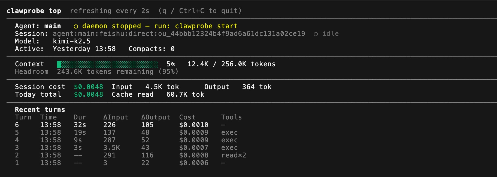

# clawprobe

**Know exactly what your OpenClaw agent is doing.**

Token usage. API cost. Context health. Smart alerts. All in one place — without touching a single line of OpenClaw's internals.

[](https://www.npmjs.com/package/clawprobe)
[](https://www.npmjs.com/package/clawprobe)
[](https://github.com/seekcontext/ClawProbe)
[](./LICENSE)

<p align="center">
  
</p>

If you find clawprobe useful, please consider giving it a ⭐ on [GitHub](https://github.com/seekcontext/ClawProbe) — it really helps!

[English](./README.md) · [简体中文](./README.zh-CN.md) · [日本語](./README.ja.md)

[Why clawprobe](#why-clawprobe) •
[Quick Start](#quick-start) •
[Commands](#commands) •
[`live`](#clawprobe-live--real-time-activity-stream) •
[Agent Integration](#agent-integration) •
[Configuration](#configuration) •
[How It Works](#how-it-works)

---

## Why clawprobe

Your OpenClaw agent lives inside a context window — burning tokens, compacting silently, spending your API budget. But you can't see any of it while it's happening.

clawprobe fixes that. It watches OpenClaw's files in the background and gives you a real-time window into what your agent is actually doing:

| Problem | clawprobe |
|---------|-----------|
| "Is my agent healthy right now?" | `clawprobe status` — instant snapshot |
| "I want to keep watching it live" | `clawprobe top` — live dashboard, auto-refreshing |
| "What is the agent doing *right now*?" | `clawprobe live` — real-time tool call stream |
| "Why is context compacting so often?" | `clawprobe context` + `clawprobe suggest` |
| "What did the agent forget after compaction?" | `clawprobe compacts` |
| "What is this costing me?" | `clawprobe cost --week` with per-model pricing |
| "Is my TOOLS.md actually reaching the model?" | Truncation detection built-in |
| "Which tools is my agent using most?" | `clawprobe session` — tool usage breakdown |
| "Did the agent finish its task list?" | `clawprobe session` — live todo progress |
| "Did it spawn sub-agents?" | `clawprobe session` — sub-agent invocation log |

**No configuration required. Zero side effects. 100% local.**

---

## Quick Start

```bash
npm install -g clawprobe

clawprobe start    # Launch background daemon (auto-detects OpenClaw)
clawprobe status   # Instant snapshot
```

clawprobe auto-detects your OpenClaw installation. No API keys, no accounts, no telemetry.

### Install as an OpenClaw skill (one command)

If you use OpenClaw, install clawprobe as a skill so your agent can monitor itself:

```bash
clawhub install clawprobe
```

Or tell your agent directly:

> Read https://raw.githubusercontent.com/seekcontext/ClawProbe/main/skills/clawprobe/SKILL.md and follow the instructions to set up clawprobe self-monitoring.

Start a new OpenClaw session and the agent will automatically have access to `clawprobe` commands for self-monitoring. See [`skills/clawprobe/SKILL.md`](./skills/clawprobe/SKILL.md) for the full skill definition.

---

## Commands

### `clawprobe status` — Instant Snapshot

Everything at a glance: session, model, context utilization, today's cost, and active alerts.

```
$ clawprobe status

📊  Agent Status  (active session)
──────────────────────────────────────────────────
  Agent:     main
  Session:   agent:main:workspace:direct:xxx ●
  Model:     moonshot/kimi-k2.5
  Active:    Today 16:41   Compacts: 2

  Context:   87.3K / 200.0K tokens  ███████░░░  44%
  Tokens:    72.4K in / 5.2K out

  Today:     $0.12  → clawprobe cost for full breakdown

  🟡  Context window at 44% capacity
       → Consider starting a fresh session or manually compacting now
```

---

### `clawprobe top` — Live Dashboard

Open it in a side terminal while your agent runs a long task. Stays on screen and updates every 2 seconds — context bar, cost counters, and a live turn-by-turn feed.

```
clawprobe top  refreshing every 2s  (q / Ctrl+C to quit)     03/18/2026 17:42:35
────────────────────────────────────────────────────────────────────────────────
  Agent: main   ● daemon running
  Session: agent:main:workspace:direct:xxx  ● active
  Model:   moonshot/kimi-k2.5
  Active:  Today 17:42   Compacts: 2
────────────────────────────────────────────────────────────────────────────────
  Context   ████████░░░░░░░░░░░░░░░░  44%   87.3K / 200.0K tokens
  Headroom  112.7K tokens remaining (56%)
────────────────────────────────────────────────────────────────────────────────
  Session cost  $0.52        Input   859.2K tok      Output   29.8K tok
  Today total   $0.67        Cache read   712.0K tok   Cache write  48.0K tok
────────────────────────────────────────────────────────────────────────────────
  Recent turns
  Turn  Time      ΔInput   ΔOutput  Cost          Note
  27    17:42     22.0K    908      $0.0094        ← latest
  26    17:19     990      630      $0.0026
  25    17:19     20.4K    661      $0.0094
  24    15:57     564      39       $0.0014
  23    15:56     18.8K    231      $0.0076        ◆ compact
────────────────────────────────────────────────────────────────────────────────
  🟡  Context window at 44% capacity
  Costs are estimates based on public pricing.
```

`q` or `Ctrl+C` to quit. Exits cleanly without leaving a mess in your terminal.

```bash
clawprobe top                  # default 2s refresh
clawprobe top --interval 5     # slower refresh
clawprobe top --agent coder    # target a specific agent
```

---

### `clawprobe live` — Real-Time Activity Stream

Open it in a side terminal to watch every tool call as it happens — not a refreshing dashboard, but a **live append-only feed** of exactly what the agent is doing: which files it's reading, which commands it's running, when it's thinking, and when a turn completes.

```
$ clawprobe live

clawprobe live  ─  agent:main:workspace:…  ─  moonshot/kimi-k2.5   q to quit

─── Turn 1  03/24 16:41 ─────────────────────────────────────────────────────
  💭 thinking…
  📖 Read           src/auth/middleware.ts
  ✏️  Edit           src/auth/middleware.ts
  📖 Read           src/auth/token.ts
  ✏️  Edit           src/auth/token.ts
  💻 Bash           npm test
  ⚠  Bash failed — exit code 1
  💻 Bash           npm test -- --filter auth
  ✓  Turn done      +1,247 tokens out

─── Turn 2  03/24 16:43 ─────────────────────────────────────────────────────
  💭 thinking…
  📖 Read           src/auth/token.ts
```

Unlike `clawprobe top` (periodic full-screen refresh), `live` is chronological and scrollable — you can scroll back to see what happened earlier in the session.

```bash
clawprobe live                   # watch the active session from now
clawprobe live --history         # replay all turns from session start
clawprobe live --agent coder     # target a specific agent
clawprobe live --file <path>     # watch a specific .jsonl transcript
```

`q` or `Ctrl+C` to quit.

---

### `clawprobe cost` — API Cost Tracking

Per-model pricing for 30+ models built-in. Tracks input, output, and cache tokens separately. Day, week, month, or all-time views.

```
$ clawprobe cost --week

💰  Weekly Cost  2026-03-12 – 2026-03-18
──────────────────────────────────────────────────
  Total:     $0.67
  Daily avg: $0.096
  Month est: $2.87

  2026-03-12  ██████████████░░  $0.15
  2026-03-16  ████████████████  $0.16
  2026-03-17  █░░░░░░░░░░░░░░░  $0.0088
  2026-03-18  ███░░░░░░░░░░░░░  $0.03

  Input:   1.0M tokens  $0.65  (97%)
  Output:  47.8K tokens  $0.03  (3%)

  Costs are estimates. Verify with your provider's billing dashboard.
```

Built-in prices for: OpenAI (GPT-4o, o1, o3, o4-mini), Anthropic (Claude 3/3.5/3.7 Sonnet/Opus/Haiku), Google (Gemini 2.0/2.5 Flash/Pro), Moonshot (kimi-k2.5), DeepSeek (v3, r1), and more. Add any unlisted model via `~/.clawprobe/config.json`.

---

### `clawprobe session` — Session Breakdown

Drill into any session: total cost, turn timeline, tool usage, todo progress, and sub-agents.

```
$ clawprobe session

📊  Session  Refactor auth module  (agent:main:workspace:…)
──────────────────────────────────────────────────
  Model:       moonshot/kimi-k2.5
  Started:     Today 14:02
  Last active: Today 16:41  (2h 39m)
  Compactions: 2

  Token usage:
    Context now:  87.3K tokens
    Output total: 29.8K tokens   $0.52

  Turn-by-turn timeline:
    Turn  1  Today 14:02   ctx  4.2K / out +312    $0.003
    Turn  2  Today 14:18   ctx 12.7K / out +891    $0.009  ← compact
    Turn  3  Today 14:41   ctx 38.1K / out +2.4K   $0.028
    …

  Tool usage:
    Read                      42 calls
    Bash                      18 calls   2 err
    Edit                      11 calls
    Grep                       9 calls

  Todo list:
    ✓  Extract JWT validation into middleware
    ✓  Add refresh token endpoint
    →  Write integration tests
    ○  Update API docs

    2/4 completed, 1 in progress

  Sub-agents (1):
    generalPurpose [moonshot/kimi-k2.5] — Run the test suite and fix failures
```

```bash
clawprobe session                    # active session
clawprobe session --list             # all sessions (shows human-readable names)
clawprobe session <key>              # specific session
clawprobe session --no-todos         # hide todo section
clawprobe session --no-turns         # hide turn timeline
clawprobe session --json             # machine-readable output
```

---

### `clawprobe context` — Context Window Analysis

Find out what's filling your context window, and catch silent truncation before it causes problems.

```
$ clawprobe context

🔍  Context Window  agent: main
──────────────────────────────────────────────────
  Used:    87.3K / 200.0K tokens  ███████░░░  44%

  Workspace overhead:  ~4.2K tokens  (7 injected files)
  Conversation est:    ~83.1K tokens  (messages + system prompt + tools)

  ⚠ TOOLS.md: 31% truncated — model never sees this content
    Increase bootstrapMaxChars in openclaw.json to fix this

  Remaining:  112.7K tokens (56%)
```

---

### `clawprobe compacts` — Compaction Events

Every compaction is captured. See exactly what was discarded — and save it before it's gone forever.

```
$ clawprobe compacts

📦  Compact Events  last 5
──────────────────────────────────────────────────

  #3  Today 16:22  [agent:main…]  3 messages

    👤  "Can you add retry logic to the upload handler?"
    🤖  "Done — added exponential backoff with 3 retries. The key change is in…"

    → Archive: clawprobe compacts --save 3
    → Archive to custom path: clawprobe compacts --save 3 --file notes/compact-log.md
```

---

### `clawprobe suggest` — Optimization Alerts

Automatic detection of common issues. Only fires when something actually needs your attention.

| Rule | What It Detects |
|------|----------------|
| `tools-truncation` | TOOLS.md cut off — tool descriptions the model can't see |
| `high-compact-freq` | Context fills too fast, compacting every < 30 minutes |
| `context-headroom` | Context window > 90% full — compaction is imminent |
| `cost-spike` | Today's spend > 2× your weekly average |
| `memory-bloat` | MEMORY.md too large — wasting tokens on every turn |

Dismiss noisy rules: `clawprobe suggest --dismiss <rule-id>`

---

## Agent Integration

clawprobe is designed to be called **by agents**, not just humans. Every command supports `--json` for clean, parseable output. Errors are always structured JSON — never coloured text that breaks parsing.

### Health check in one call

```bash
clawprobe status --json
```

```json
{
  "agent": "main",
  "daemonRunning": true,
  "sessionKey": "agent:main:workspace:direct:xxx",
  "model": "moonshot/kimi-k2.5",
  "sessionTokens": 87340,
  "windowSize": 200000,
  "utilizationPct": 44,
  "todayUsd": 0.12,
  "suggestions": [
    {
      "severity": "warning",
      "ruleId": "context-headroom",
      "title": "Context window at 44% capacity",
      "detail": "...",
      "action": "Consider starting a fresh session or manually compacting now"
    }
  ]
}
```

### Discover the output schema

```bash
clawprobe schema           # list all commands
clawprobe schema status    # full field spec for status --json
clawprobe schema cost      # full field spec for cost --json
```

### Dismiss a suggestion programmatically

```bash
clawprobe suggest --dismiss context-headroom --json
# → { "ok": true, "dismissed": "context-headroom" }
```

### Errors are always parseable

```bash
clawprobe session --json   # no active session
# → { "ok": false, "error": "no_active_session", "message": "..." }
# exit code 1
```

---

## Configuration

Optional config at `~/.clawprobe/config.json` — auto-created on first `clawprobe start`:

```json
{
  "timezone": "Asia/Shanghai",
  "openclaw": {
    "dir": "~/.openclaw",
    "agent": "main"
  },
  "cost": {
    "customPrices": {
      "my-provider/my-model": { "input": 1.00, "output": 3.00 }
    }
  },
  "alerts": {
    "dailyBudgetUsd": 5.00
  },
  "rules": {
    "disabled": ["memory-bloat"]
  }
}
```

Most users need zero configuration. clawprobe auto-detects everything from your existing OpenClaw setup.

---

## How It Works

clawprobe reads OpenClaw's existing files in the background — no code changes, no plugins, no hooks required.

- **Zero configuration** — auto-detects OpenClaw at `~/.openclaw`
- **Zero side effects** — never touches OpenClaw's files; writes only to `~/.clawprobe/`
- **Background daemon** — `clawprobe start` watches for changes and keeps the local database current
- **Minimal footprint** — 4 production dependencies, no cloud services, no telemetry

---

## Privacy

- **100% local** — no data ever leaves your machine
- **No telemetry** — clawprobe collects nothing
- **No accounts, no API keys** — install and run

---

## Compatibility

Works with any OpenClaw version. Requires Node.js ≥ 22 · macOS or Linux (Windows via WSL2).

---

## Contributing

MIT licensed. Contributions welcome.

```bash
git clone https://github.com/seekcontext/ClawProbe
cd ClawProbe && npm install && npm run dev
```

---

[MIT License](./LICENSE)
